# Enhanced AI Flow Diagram with All Intent Cases

## Complete Flow Architecture with AI Recommendations

```mermaid
flowchart TD
    Start([Customer Calls<br/>978-307-7738]) --> Greeting[Play Greeting:<br/>Thank you for calling<br/>John Hancock LTC]
    
    Greeting --> CaptureIntent[Capture Speech Input<br/>How can I help you today?]
    
    CaptureIntent --> IntentClassifier{GPT-4o Intent<br/>Classifier<br/>100+ Patterns}
    
    %% Intent Classification Branches
    IntentClassifier -->|CLAIM_STATUS<br/>90% confidence| ClaimBranch[Intent: CLAIM_STATUS]
    IntentClassifier -->|PAYMENT<br/>90% confidence| PaymentBranch[Intent: PAYMENT]
    IntentClassifier -->|COVERAGE_INQUIRY<br/>90% confidence| CoverageBranch[Intent: COVERAGE_INQUIRY]
    IntentClassifier -->|RATE_INCREASE<br/>90% confidence| RateBranch[Intent: RATE_INCREASE]
    IntentClassifier -->|AGENT_REQUEST<br/>90% confidence| AgentBranch[Intent: AGENT_REQUEST]
    IntentClassifier -->|UNKNOWN<br/><70% confidence| LowConfidence[Intent: UNKNOWN<br/>Low Confidence]
    IntentClassifier -->|Third-Party<br/>Detected| ThirdParty[Relationship:<br/>Third-Party]
    
    %% CLAIM_STATUS Flow
    ClaimBranch --> ClaimCheck{Can Self-Serve?<br/>Owner + High Confidence}
    ClaimCheck -->|Yes| ClaimAI[AI Recommendations:<br/>Primary: Provide status<br/>Secondary: Proactive updates<br/>Education: Processing times]
    ClaimAI --> ClaimLookup[Lambda: Self-Service<br/>Mock Claim Lookup<br/>Phone ending in 8]
    ClaimLookup --> ClaimVariations{Claim Pattern<br/>Matched}
    
    ClaimVariations -->|check claim status| ClaimResponse1[Your claim CLM-45686<br/>was approved for $2,800]
    ClaimVariations -->|where is my check| ClaimResponse1
    ClaimVariations -->|reimbursement status| ClaimResponse1
    ClaimVariations -->|track my claim| ClaimResponse1
    ClaimVariations -->|how long does claim take| ClaimResponse1
    ClaimVariations -->|claim number| ClaimResponse1
    
    ClaimResponse1 --> ClaimEducation[Educational Content:<br/>Check mailed 04/18/2026<br/>Arrives in 5-7 days<br/>Track at johhancock.com]
    ClaimEducation --> AnythingElse1
    
    %% PAYMENT Flow
    PaymentBranch --> PaymentCheck{Can Self-Serve?<br/>Owner + High Confidence}
    PaymentCheck -->|Yes| PaymentAI[AI Recommendations:<br/>Primary: Amount & due date<br/>Secondary: Offer autopay<br/>Education: Payment methods]
    PaymentAI --> PaymentLookup[Lambda: Self-Service<br/>Mock Payment Lookup]
    PaymentLookup --> PaymentVariations{Payment Pattern<br/>Matched}
    
    PaymentVariations -->|pay premium| PaymentResponse1[Premium: $285<br/>Due: May 1st, 2026<br/>Last paid: April 1st]
    PaymentVariations -->|when is payment due| PaymentResponse1
    PaymentVariations -->|how much do I owe| PaymentResponse1
    PaymentVariations -->|set up autopay| PaymentResponse2[To set up autopay:<br/>Visit portal or<br/>call 1-800-555-1234]
    PaymentVariations -->|payment overdue| PaymentResponse3[Payment was due May 1st<br/>Please pay immediately<br/>to avoid lapse]
    PaymentVariations -->|missed payment| PaymentResponse3
    
    PaymentResponse1 --> PaymentEducation[Educational Content:<br/>Payment methods available<br/>Autopay saves 3%<br/>Grace period: 31 days]
    PaymentResponse2 --> PaymentEducation
    PaymentResponse3 --> PaymentEducation
    PaymentEducation --> AnythingElse1
    
    %% COVERAGE_INQUIRY Flow
    CoverageBranch --> CoverageCheck{Can Self-Serve?<br/>Owner + High Confidence}
    CoverageCheck -->|Yes| CoverageAI[AI Recommendations:<br/>Primary: Benefits & limits<br/>Secondary: Care examples<br/>Education: Benefit triggers]
    CoverageAI --> CoverageLookup[Lambda: Self-Service<br/>Mock Coverage Lookup]
    CoverageLookup --> CoverageVariations{Coverage Pattern<br/>Matched}
    
    CoverageVariations -->|what does policy cover| CoverageResponse1[Daily benefit: $200<br/>Lifetime max: $300,000<br/>Elimination: 90 days]
    CoverageVariations -->|nursing home coverage| CoverageResponse2[Nursing home: $200/day<br/>Assisted living: $160/day<br/>Home care: $120/day]
    CoverageVariations -->|what are my benefits| CoverageResponse1
    CoverageVariations -->|elimination period| CoverageResponse3[90-day elimination period<br/>Coverage starts after<br/>90 days of receiving care]
    CoverageVariations -->|inflation protection| CoverageResponse4[You have 3% compound<br/>inflation protection<br/>Benefits grow annually]
    
    CoverageResponse1 --> CoverageEducation[Educational Content:<br/>Care types covered<br/>Benefit qualification<br/>How to file claims]
    CoverageResponse2 --> CoverageEducation
    CoverageResponse3 --> CoverageEducation
    CoverageResponse4 --> CoverageEducation
    CoverageEducation --> AnythingElse1
    
    %% RATE_INCREASE Flow
    RateBranch --> RateCheck{Can Self-Serve?<br/>Owner + High Confidence}
    RateCheck -->|Yes| RateAI[AI Recommendations:<br/>Primary: Explain transparently<br/>Secondary: Cost reduction options<br/>Education: Industry trends]
    RateAI --> RateSentiment{Sentiment<br/>Detection}
    
    RateSentiment -->|Frustrated/Angry| RateEmpathy[Add Empathy:<br/>Acknowledge concern<br/>Apologize first]
    RateSentiment -->|Neutral| RateLookup[Lambda: Self-Service<br/>Mock Rate Lookup]
    RateEmpathy --> RateLookup
    
    RateLookup --> RateVariations{Rate Pattern<br/>Matched}
    
    RateVariations -->|why did rate go up| RateResponse1[Current: $285<br/>No scheduled increase<br/>Phone ends in 8]
    RateVariations -->|why did bill go up| RateResponse1
    RateVariations -->|premium is higher| RateResponse1
    RateVariations -->|letter about rate| RateResponse2[For phone ending 1-3:<br/>Increasing 8% to $307.80<br/>Effective July 1st, 2026]
    RateVariations -->|cost went up| RateResponse1
    RateVariations -->|bill increased| RateResponse1
    
    RateResponse1 --> RateEducation[Educational Content:<br/>Why rates increase<br/>Options to reduce premium<br/>State insurance contact]
    RateResponse2 --> RateOptions[Cost Reduction Options:<br/>Reduce daily benefit<br/>Longer elimination period<br/>Remove inflation rider]
    RateOptions --> RateEducation
    RateEducation --> AnythingElse1
    
    %% AGENT_REQUEST Flow
    AgentBranch --> AgentAI[AI Recommendations:<br/>Primary: Route to specialist<br/>Secondary: Identify concern<br/>Escalation: Direct request]
    AgentAI --> AgentVariations{Agent Request<br/>Pattern}
    
    AgentVariations -->|speak to agent| AgentTransfer1[Transfer to Agent:<br/>General queue]
    AgentVariations -->|I need a human| AgentTransfer1
    AgentVariations -->|talk to person| AgentTransfer1
    AgentVariations -->|specialist needed| AgentTransfer2[Transfer to Agent:<br/>Specialist queue]
    AgentVariations -->|supervisor request| AgentTransfer3[Transfer to Agent:<br/>Supervisor queue]
    
    AgentTransfer1 --> HoldMusic[Play Hold Music<br/>Estimated wait time]
    AgentTransfer2 --> HoldMusic
    AgentTransfer3 --> HoldMusic
    HoldMusic --> AgentPickup[Simulated Agent:<br/>Thank you for holding]
    AgentPickup --> Goodbye
    
    %% UNKNOWN / Low Confidence Flow
    LowConfidence --> LowConfidenceAI[AI Recommendations:<br/>Primary: Ask clarification<br/>Secondary: Provide menu<br/>Education: Common intents]
    LowConfidenceAI --> Clarification[Ask Clarification:<br/>Are you calling about<br/>claim, payment, coverage,<br/>or rate increase?]
    
    Clarification --> ClarificationCapture[Capture Clarified<br/>Response]
    ClarificationCapture --> Reclassify{Re-classify Intent<br/>with Context}
    
    Reclassify -->|Claim| ClaimBranch
    Reclassify -->|Payment| PaymentBranch
    Reclassify -->|Coverage| CoverageBranch
    Reclassify -->|Rate| RateBranch
    Reclassify -->|Still Unclear| AgentTransfer1
    
    %% Third-Party Flow
    ThirdParty --> ThirdPartyAI[AI Recommendations:<br/>Primary: Verify authorization<br/>Secondary: Explain HIPAA<br/>Escalation: POA required]
    ThirdPartyAI --> ThirdPartyVariations{Third-Party<br/>Pattern}
    
    ThirdPartyVariations -->|calling for mother| ThirdPartyMessage1[For privacy & security<br/>need to verify authorization<br/>Transferring to agent]
    ThirdPartyVariations -->|calling for father| ThirdPartyMessage1
    ThirdPartyVariations -->|power of attorney| ThirdPartyMessage1
    ThirdPartyVariations -->|calling for parent| ThirdPartyMessage1
    
    ThirdPartyMessage1 --> ThirdPartyTransfer[Transfer to Agent:<br/>Authorization queue<br/>Context: POA verification needed]
    ThirdPartyTransfer --> HoldMusic
    
    %% Anything Else Loop
    AnythingElse1[Is there anything else<br/>I can help you with?<br/>Say yes/press 1 or no/press 2]
    AnythingElse1 --> AnythingElseInput{User Response}
    
    AnythingElseInput -->|Yes / 1| LoopBack[Sure, what else<br/>can I help with?]
    AnythingElseInput -->|No / 2| Goodbye
    AnythingElseInput -->|Timeout 5 sec| Goodbye
    
    LoopBack --> CaptureIntent
    
    %% Goodbye Flow
    Goodbye[Thank you for calling<br/>John Hancock LTC<br/>Have a great day!]
    Goodbye --> End([End Call])
    
    %% Error Handling
    ClaimCheck -->|No| AgentTransfer1
    PaymentCheck -->|No| AgentTransfer1
    CoverageCheck -->|No| AgentTransfer1
    RateCheck -->|No| AgentTransfer1
    
    %% Styling
    classDef intentClass fill:#FFE5A0,stroke:#333,stroke-width:2px
    classDef aiClass fill:#E8F5E9,stroke:#333,stroke-width:2px
    classDef lambdaClass fill:#424242,stroke:#333,stroke-width:2px,color:#fff
    classDef transferClass fill:#FFCDD2,stroke:#333,stroke-width:2px
    classDef decisionClass fill:#FFF9C4,stroke:#333,stroke-width:2px
    
    class ClaimBranch,PaymentBranch,CoverageBranch,RateBranch,AgentBranch intentClass
    class ClaimAI,PaymentAI,CoverageAI,RateAI,AgentAI,LowConfidenceAI,ThirdPartyAI,RateEmpathy aiClass
    class ClaimLookup,PaymentLookup,CoverageLookup,RateLookup lambdaClass
    class AgentTransfer1,AgentTransfer2,AgentTransfer3,ThirdPartyTransfer transferClass
    class IntentClassifier,ClaimCheck,PaymentCheck,CoverageCheck,RateCheck,RateSentiment decisionClass
```



---

## Flow Summary Statistics

### Intent Categories (5 Total)
1. **CLAIM_STATUS** - 6 variation examples shown
2. **PAYMENT** - 6 variation examples shown  
3. **COVERAGE_INQUIRY** - 5 variation examples shown
4. **RATE_INCREASE** - 6 variation examples shown
5. **AGENT_REQUEST** - 5 variation examples shown

### Decision Points (12 Total)
- Intent Classifier (7-way)
- Can Self-Serve checks (4×)
- Sentiment Detection (1×)
- Anything Else Response (3-way)

### Self-Service Paths (4 Intent Types)
Each with:
- AI Recommendation engine
- Pattern matching (100+ total patterns)
- Lambda lookup
- Educational content
- Proactive suggestions

### Agent Transfer Paths (3 Types)
- Direct agent request → General queue
- Specialist needed → Specialist queue
- Third-party caller → Authorization queue

### Loop Mechanisms
- Anything Else → Back to Intent Capture (unlimited)
- Low Confidence → Clarification → Re-classification → Self-Service

---

## Pattern Matching Examples by Intent

### CLAIM_STATUS (20+ patterns)
```
✅ "check claim status"
✅ "where is my check"
✅ "reimbursement status"
✅ "track my claim"
✅ "how long does claim take"
✅ "claim number"
✅ "submitted claim and want to know status"
✅ "when will my claim be processed"
✅ "claim payment"
✅ "where is my money"
```

### PAYMENT (25+ patterns)
```
✅ "pay premium"
✅ "when is payment due"
✅ "how much do I owe"
✅ "set up autopay"
✅ "payment overdue"
✅ "missed payment"
✅ "bill amount"
✅ "monthly premium"
✅ "late payment"
✅ "pay online"
```

### COVERAGE_INQUIRY (20+ patterns)
```
✅ "what does policy cover"
✅ "nursing home coverage"
✅ "what are my benefits"
✅ "elimination period"
✅ "inflation protection"
✅ "daily benefit amount"
✅ "assisted living benefits"
✅ "home care coverage"
✅ "lifetime maximum"
✅ "waiting period"
```

### RATE_INCREASE (35+ patterns)
```
✅ "why did rate go up" ← FIXED!
✅ "why did bill go up" ← FIXED!
✅ "premium is higher"
✅ "letter about rate"
✅ "cost went up"
✅ "bill increased"
✅ "rate change"
✅ "premium adjustment"
✅ "more expensive"
✅ "paying more"
```

### AGENT_REQUEST (15+ patterns)
```
✅ "speak to agent"
✅ "I need a human"
✅ "talk to person"
✅ "specialist needed"
✅ "supervisor request"
✅ "transfer me"
✅ "customer service"
✅ "real person"
✅ "connect me with someone"
✅ "representative"
```

---

## AI Recommendations Output Examples

### CLAIM_STATUS + Neutral Sentiment
```json
{
  "primaryAction": "Provide real-time claim status with tracking",
  "secondaryActions": [
    "Offer proactive email/SMS updates",
    "Explain next steps in process",
    "Provide estimated completion timeline"
  ],
  "educationalContent": [
    "Processing timeframes: 7-14 business days",
    "Required documentation checklist",
    "How to expedite claims"
  ],
  "escalationReason": "",
  "customerExperience": ""
}
```

### RATE_INCREASE + Frustrated Sentiment
```json
{
  "primaryAction": "Explain increase reason transparently",
  "secondaryActions": [
    "❗ Acknowledge concern and apologize for frustration",
    "Offer rate stability options",
    "Explain industry-wide trends",
    "Provide pricing disclosure comparison"
  ],
  "educationalContent": [
    "Why LTC rates increase",
    "Options to reduce premium",
    "State insurance department contact"
  ],
  "escalationReason": "",
  "customerExperience": "⚠️ Negative emotion - prioritize empathy"
}
```

### UNKNOWN + Low Confidence
```json
{
  "primaryAction": "Ask clarifying question",
  "secondaryActions": [
    "❗ Confirm understanding before proceeding",
    "Provide menu of common intents",
    "Use open-ended question",
    "Offer agent transfer if still unclear"
  ],
  "educationalContent": [
    "Common reasons customers call",
    "Self-service options available"
  ],
  "escalationReason": "Intent unclear after clarification",
  "customerExperience": "⚠️ Low confidence - ask confirmation"
}
```

---

## Flow Metrics

### Coverage
- **Total Patterns**: 100+
- **Intent Categories**: 5
- **Self-Service Paths**: 4
- **Agent Transfer Paths**: 3
- **Educational Touchpoints**: 4
- **Loop Mechanisms**: 2

### Performance Targets
- **Intent Recognition**: 92%+ accuracy
- **Self-Service Rate**: 65%+
- **Average Handle Time**: 90 seconds (self-service)
- **Customer Education**: 75% receive educational content
- **First Call Resolution**: 82%+

### Business Impact
- **Monthly Call Volume**: 50,000
- **Self-Service Calls**: 32,500 (65%)
- **Agent Transfers**: 17,500 (35%)
- **Estimated Monthly Savings**: $93,750
- **Estimated Annual Savings**: $1,125,000

---

## Visual Legend

- 🟡 **Yellow Boxes**: Intent categories and user inputs
- 🟢 **Green Boxes**: AI recommendations and educational content
- ⚫ **Black Boxes**: Lambda functions and backend processing
- 🔴 **Red Boxes**: Agent transfers and escalations
- 💠 **Diamond Shapes**: Decision points and routing logic

---

## Next Steps to Use This Diagram

1. **View in Mermaid**: Copy the code block and paste into:
   - [Mermaid Live Editor](https://mermaid.live/)
   - GitHub Markdown (renders automatically)
   - VS Code with Mermaid extension

2. **Export Options**:
   - PNG/SVG for presentations
   - PDF for documentation
   - HTML for interactive viewing

3. **Customize**:
   - Add more pattern examples
   - Show specific response messages
   - Include timing metrics
   - Add customer journey paths
